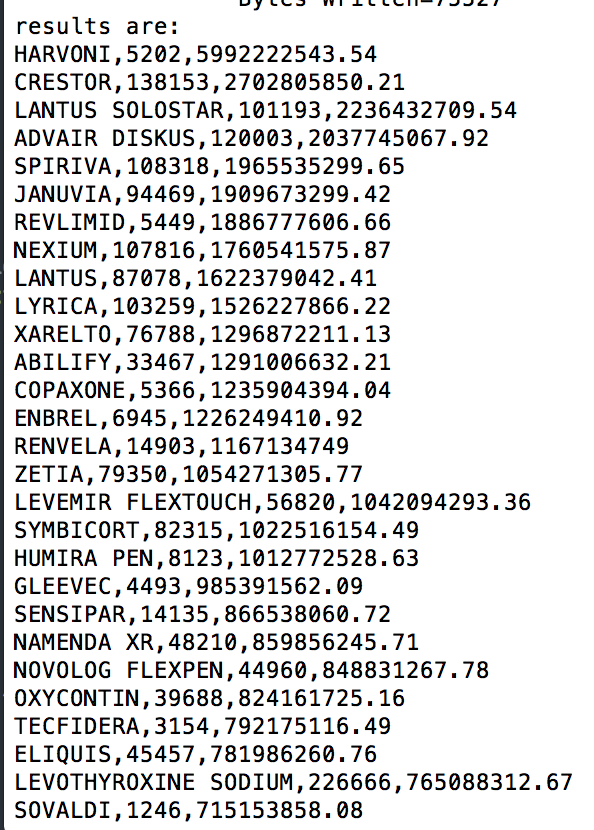

# Insight Data Pharmacy
This Hadoop MapReduce program can be run in hadoop clusters. It can run within docker or AWS cloud.

##**Steps to run:**

* Clone this project. 
* Put you input file under the directory /input. This file could be the ```de_cc_data.txt```which has 2 decimal points of cost. [Since github doesn't allow large file, you have to do it manually].

* package the whole project

```
$ tar -cf HadoopInsight.tar HadoopInsight/
```
* You shall start your docker container or ssh to your AWS, and run your hadoop cluster as you want. 

* Move this **HadoopInsight.tar** file to where your hadoop root is

* Run the bash script.

```
root@hadoop-master:~# ./run_pharmacy.sh
```
* The system shall start to run

* A sample successful output will be



**You will find the success output located at the hdfs
```/output/part-r-00000```**

## Map Reduce Jobs

There are mainly 2 map reduce jobs in this design:

* The first job is to use mapper to build key-value as **\<drug_name firstnamelastname:cost\>**. The Reducer use a hashSet to remove duplicate of prescriber name, and output the total number of unique prescribers, and also sum up all the cost for each drug. For precision, I chose to use Big Decimal class in java.
* The intermediate output is printed out in directory ```/intermediate```
* The second job's main job is to take the intermediate output, and use mapper to map **totalcost** as key to sort by descending order, and the reducer is only responsible of writing the value out.

## Author

Yinchen LI

Date: 07.16.2018

Email: careeryinchenli@gmail.com


